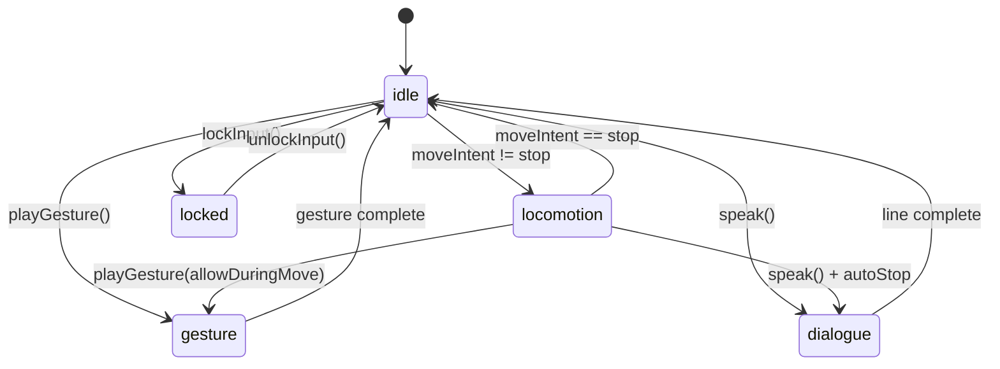

# Alephillo — Especificación funcional

Contrato público entre la marioneta y el resto del juego. El ingeniero implementa este API; diseño y animación cumplen los nombres y semántica aquí definidos.

---

## Identidad del GameObject

| Campo | Valor |
|-------|-------|
| `id` | `gameobjects.alephillo` |
| `displayName` | Alephillo |
| `tag` | `Player` \| `Puppet` (configurable) |
| `version` | `0.1.0-spec` |

---

## API pública (contrato lógico)

Pseudointerfaz agnóstica de motor:

```typescript
interface Alephillo {
  // --- Estado ---
  readonly state: AlephilloState;
  readonly mood: MoodId;
  readonly isMoving: boolean;
  readonly isGesturePlaying: boolean;

  // --- Locomoción (llamada por input o IA) ---
  setMoveIntent(intent: MoveIntent): void;
  setLookTarget(target: Vector3 | null): void;

  // --- Expresión ---
  setMood(mood: MoodId, blendSeconds?: number): void;
  playGesture(gesture: GestureId, options?: GestureOptions): Promise<void>;
  cancelGestures(slot?: AdditiveSlot): void;

  // --- Narrativa ---
  speak(line: DialogueLine): Promise<void>;
  beat(durationSeconds?: number): Promise<void>;

  // --- Control de capa ---
  lockInput(reason: string): void;
  unlockInput(reason: string): void;

  // --- Eventos ---
  on(event: AlephilloEvent, handler: Handler): Unsubscribe;
}
```

### Tipos auxiliares

```typescript
type AlephilloState =
  | 'idle'
  | 'locomotion'
  | 'gesture'
  | 'dialogue'
  | 'locked';      // cutscene

type MoodId =
  | 'neutral'
  | 'wonder'
  | 'doubt'
  | 'melancholy'
  | 'spark'
  | 'unease';

type MoveIntent = {
  direction: Vector2;   // normalizado, espacio cámara o mundo
  speed: 'stop' | 'walk' | 'walk_slow';
};

type GestureId = string; // catálogo en ANIMATION.md § Gestos

type GestureOptions = {
  slot?: AdditiveSlot;      // 1–4, auto si omitido
  weight?: number;          // 0–1, default 1
  queue?: 'replace' | 'fifo' | 'drop';
  onPeak?: () => void;      // frame de máxima expresión
};

type AdditiveSlot = 1 | 2 | 3 | 4;

type DialogueLine = {
  text: string;
  mood?: MoodId;
  gesture?: GestureId;
  autoBeat?: boolean;
};
```

---

## Máquina de estados



### Prioridades

1. `locked` — ignora todo excepto animación scripted externa.
2. `dialogue` — bloquea locomoción salvo `speak({ allowMove: true })` (extensión opcional).
3. `gesture` — no bloquea locomoción salvo gestos marcados `fullBody: true`.
4. `locomotion` / `idle` — estado por defecto.

---

## Eventos

| Evento | Payload | Cuándo |
|--------|---------|--------|
| `stateChanged` | `{ from, to }` | Transición de máquina de estados |
| `moodChanged` | `{ mood, previous }` | Tras blend de mood |
| `gestureStarted` | `{ id, slot }` | Al iniciar aditivo |
| `gestureEnded` | `{ id, slot, completed }` | Al terminar o cancelar |
| `footstep` | `{ foot: 'L' \| 'R' }` | Frame marcado en walk clips |
| `lineStart` | `DialogueLine` | Antes de mostrar texto |
| `lineEnd` | `DialogueLine` | Tras beat opcional |
| `beat` | `{ duration }` | Pausa dramática |
| `lookTargetReached` | `{ target }` | Cabeza dentro de umbral angular |

Suscripción ejemplo:

```typescript
alephillo.on('footstep', ({ foot }) => audio.play('step_paper', foot));
alephillo.on('lineEnd', () => quest.advance('intro_done'));
```

---

## Integración con input

### Mapeo recomendado (tercera persona)

| Input | Acción |
|-------|--------|
| Stick / WASD | `setMoveIntent({ direction, speed: 'walk' })` |
| Shift / trigger | `speed: 'walk_slow'` (contemplación) |
| Sin input 2 s | auto `setMood('neutral')` + idle variante |
| Interact | `playGesture('point')` + raycast desde `Attach_Head` |

### Integración con IA (NPC poseído)

Misma API. El pathfinding alimenta `setMoveIntent`; el behaviour tree elige `setMood` / `playGesture`.

---

## Integración con diálogo

Flujo estándar `speak()`:

1. Si hay `line.mood` → `setMood(line.mood, 0.3)`.
2. Emitir `lineStart`.
3. Mostrar UI texto (sistema externo).
4. Si hay `line.gesture` → `playGesture` en paralelo.
5. Esperar duración mínima = `text.length * 0.04` s (tunable).
6. Si `autoBeat` → `beat(0.6)`.
7. Emitir `lineEnd`.

**Regla de escritura:** líneas ≤ 120 caracteres; Alephillo no monologa.

---

## Integración con el mundo

### Registro en escena

```yaml
# Ejemplo manifest (formato libre)
spawn:
  prefab: alephillo
  position: [0, 0, 0]
  rotation_y: 180
  mood: neutral
  outfit: default
camera:
  follow: alephillo
  offset: [0, 1.4, 4.0]
  look_at_height: 1.2
```

### Capas de física / render

| Capa | Uso |
|------|-----|
| `Character` | Alephillo + NPCs jugables |
| `Environment` | Mundo línea |
| `Interactable` | Objetos con segundo trazo |

### Zonas de ambiente

Triggers opcionales en nivel:

| Zona | Efecto en Alephillo |
|------|---------------------|
| `VignetteZone` | Margen blanco en post-proceso |
| `ColorAccentZone` | Permite `accent.*` en objetos |
| `WindZone` | Aditivo `ADD_hat_brush` peso según intensidad |
| `SilenceZone` | Suprime footstep audio |

---

## Configuración (data-driven)

Archivo sugerido: `alephillo.config.json`

```json
{
  "locomotion": {
    "walkSpeed": 1.4,
    "walkSlowSpeed": 0.7,
    "turnSpeedDeg": 120,
    "idleVariantIntervalSec": [8, 15]
  },
  "expression": {
    "moodBlendDefaultSec": 0.4,
    "maxSimultaneousGestures": 3,
    "gestureQueueMax": 4
  },
  "lookAt": {
    "headYawLimitDeg": 70,
    "headPitchLimitDeg": 35,
    "blendSec": 0.2
  },
  "dialogue": {
    "charsPerSecond": 25,
    "defaultBeatSec": 0.5
  }
}
```

---

## Extensiones previstas (hooks)

| Hook | Propósito |
|------|-----------|
| `attachProp(socket, prefabId)` | Sombrero alternativo, objeto en mano |
| `setOutfit(outfitId)` | Cambio de textura sin swap de skeleton |
| `registerGesture(id, clipRef)` | DLC / modding de gestos |
| `overrideOutline(width, color)` | Viñetas especiales |

No implementar en v0.1; reservar nombres.

---

## Criterios de aceptación

El integrador marca DONE cuando:

- [ ] Alephillo se lee claramente a 80 px de alto en pantalla 1080p.
- [ ] Caminar + `ADD_shrug` simultáneo sin foot sliding visible (> 2 s).
- [ ] Cambio `neutral` → `wonder` en ≤ 0.5 s perceptible.
- [ ] `speak()` + gesto + beat encadena sin bloquear input tras terminar.
- [ ] Outline estable al rotar cámara 360°.
- [ ] Presupuesto TECHNICAL.md cumplido en hardware referencia.
- [ ] Tres NPCs línea + Alephillo: FPS ≥ objetivo.
- [ ] Ningún acento de color fuera de reglas DESIGN.md en escena normal.

---

## Casos de prueba sugeridos

| ID | Escenario | Resultado esperado |
|----|-----------|-------------------|
| T01 | Caminar 10 m, soltar stick | Transición a `idle_breathe` en 0.2 s |
| T02 | Spam 5 gestos rápidos | Cola FIFO; no más de 3 pesos activos |
| T03 | `lockInput` durante `speak` | No locomoción hasta unlock |
| T04 | `lookAt` NPC a 5 m | Cabeza sigue; pies siguen caminando |
| T05 | LOD2 a 40 m | Silueta legible o billboard |
| T06 | Zona `ColorAccentZone` | Objeto marcado usa `accent.sky` |

---

## Glosario funcional

| Término | Definición |
|---------|------------|
| **Intent** | Vector de deseo de movimiento; no posición absoluta |
| **Mood** | Estado emocional persistente que modula pesos |
| **Gesture** | Aditivo one-shot o hold |
| **Beat** | Silencio dramático entre líneas |
| **Locked** | Input deshabilitado por cutscene o sistema |
