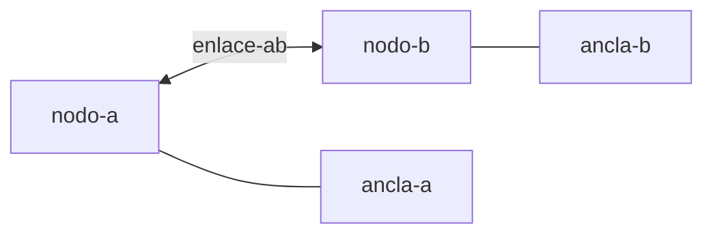

# Gamemap — Escenas

## Escena vs instancia

| Concepto | Qué es |
|----------|--------|
| **Escena (definición)** | YAML/JS en `gamethings/escenas/` — nodos, enlaces, anclas estáticos |
| **Escena (runtime)** | Módulo en `shared/scenes/` o carga en `MapEngine` |
| **Instancia** | Escena + actores vivos + estado mutable |

Una escena **no se renderiza**. Es un grafo:



---

## Fuente de verdad

1. **Diseño humano:** `gamethings/escenas/vaiven-dos-nodos.yaml`
2. **Runtime:** `packages/game/runtime/scenes/vaiven-dos-nodos.mjs` (espejo ejecutable)
3. **Reglas:** `gamethings/{casa,camino,silla}/FUNCTIONAL.md`

Al cambiar YAML, actualizar el `.mjs` o añadir loader (v0.2).

---

## Entidades en mapa (plano)

```typescript
interface MapInstance {
  sceneId: string;
  actors: Record<string, ActorState>;
  anchors: Record<string, { occupiedBy: string | null }>;
  tick: number;
}
```

**No** anidar meshes. **Sí** referencias por id:

```yaml
actors:
  robot-ping:
    kind: gameobjects.alephillo-robot
    zone: nodo-a
    anchorId: ancla-a
```

---

## Escenas incluidas

| ID | Archivo | Descripción |
|----|---------|-------------|
| `vaiven-dos-nodos` | [gamethings/escenas/vaiven-dos-nodos.yaml](../gamethings/escenas/vaiven-dos-nodos.yaml) | Loop dos celdas |

---

## Extensión

Nueva escena = nuevo YAML + módulo runtime + registro en `gamemap/scenes/index` (futuro).
