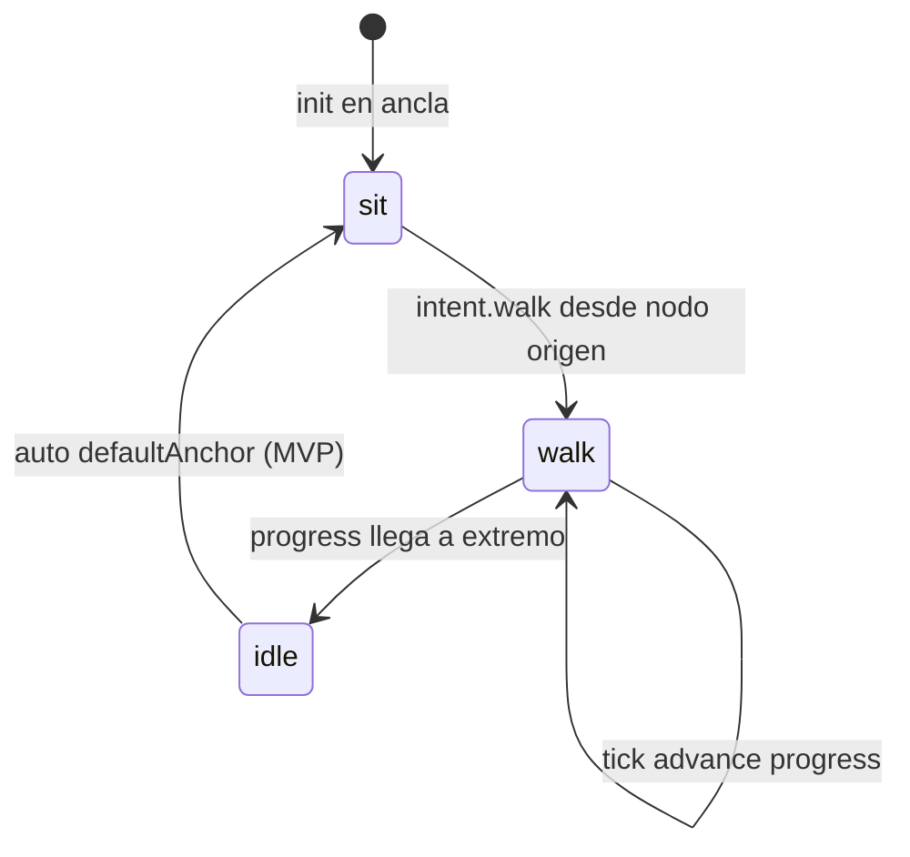

# Gamemap — Tick

Bucle lógico de la autoridad del mapa. Independiente del frame rate del viewer.

---

## Parámetros MVP

| Parámetro | Default | Env |
|-----------|---------|-----|
| Intervalo tick | 100 ms | `MAP_TICK_MS` |
| Heartbeat estado | 1000 ms | `MAP_STATE_HEARTBEAT_MS` |

---

## Orden por tick

```
1. MapEngine.tick(deltaSec)
2. drainEvents() → log / métricas
3. Si hubo cambios O heartbeat → publish GAME_STATE
```

---

## Transiciones (reglas gamethings)



### `intent.walk`

- Valida `actor.zone === link.from` (según direction)
- Libera ancla
- `zone` → `linkId`, `pose` → `walk`
- `progress` → 0 (`a-to-b`) o 1 (`b-to-a`)

### Tick en walk

```javascript
progress += sign * (walkSpeed * delta) / linkDistance
position = sampleLink(waypoints, progress)
```

### Llegada

- `a-to-b` y `progress >= 1` → `zone = nodo-b`, auto `sit` en `ancla-b`
- `b-to-a` y `progress <= 0` → `zone = nodo-a`, auto `sit` en `ancla-a`

---

## Loop documentado (vaiven)

Ver [gamethings/escenas/vaiven-dos-nodos.yaml](../gamethings/escenas/vaiven-dos-nodos.yaml) sección `loop`.

El `walk-app` automatiza intents; el mapa ejecuta física lógica.

---

## Criterios de aceptación

- [ ] 12 m de enlace @ 1.4 m/s ≈ 8.6 s de travesía.
- [ ] Sin foot sliding lógico: `position` coherente con `progress`.
- [ ] Una sola `link_exit` por travesía.
